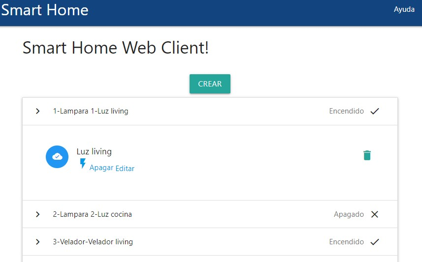
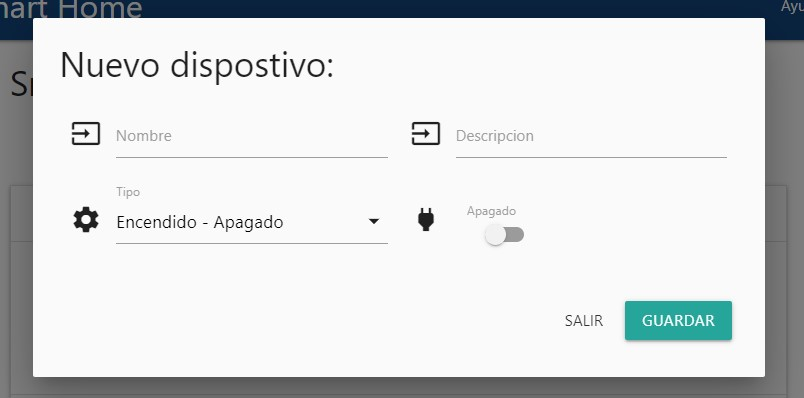
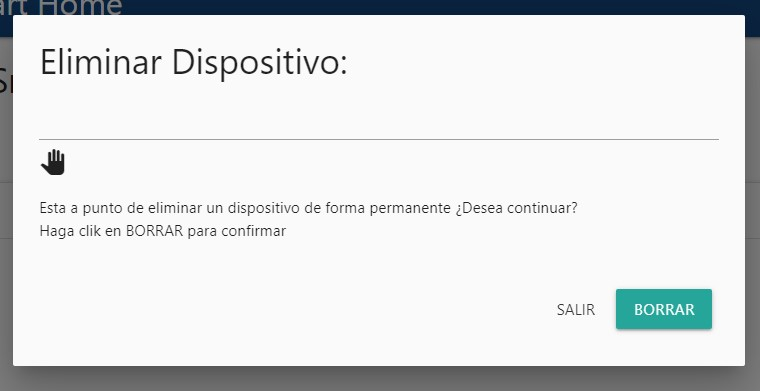
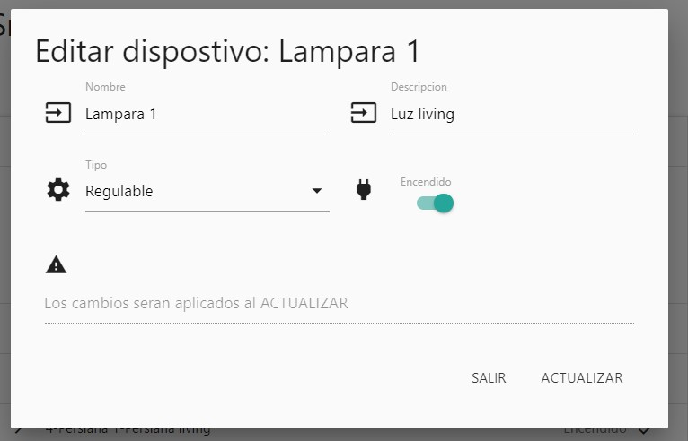
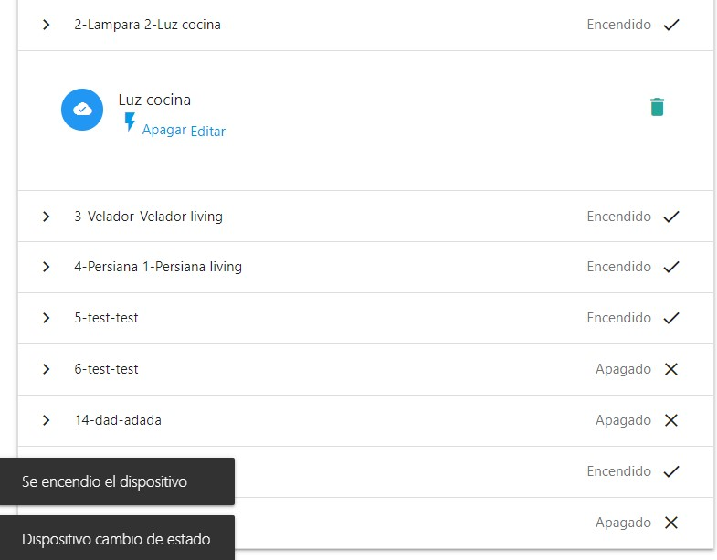

Tp Final DAW
=======================

Este es el Tp Final para Desarrollo de aplicaciones web - CEIoT - 8va Cohorte 2023 - 2do bimestre

El proyecto se basa en el original, pero con algunos ajustes para permitir cubrir las funcionalidades siguientes:
- Listar dispositivos existentes
- Interactuar con un dispositivo
-- Apagarlo o encenderlo
-- Eliminarlo
- Editar cualquier valor de un dispositivo

La aplicación IoT de base que viene con este proyecto se encarga de crear una tabla llamada `Devices` en la base de datos



## Comenzando 🚀

Esta sección es una guía con los pasos escenciales para que puedas poner en marcha la aplicación.

<details><summary><b>Mira los pasos necesarios</b></summary><br>

### Instalar las dependencias

Para correr este proyecto es necesario que instales `Docker` y `Docker Compose`. 

En [este artículo](https://www.gotoiot.com/pages/articles/docker_installation_linux/) publicado en nuestra web están los detalles para instalar Docker y Docker Compose en una máquina Linux. Si querés instalar ambas herramientas en una Raspberry Pi podés seguir [este artículo](https://www.gotoiot.com/pages/articles/rpi_docker_installation) de nuestra web que te muestra todos los pasos necesarios.

En caso que quieras instalar las herramientas en otra plataforma o tengas algún incoveniente, podes leer la documentación oficial de [Docker](https://docs.docker.com/get-docker/) y también la de [Docker Compose](https://docs.docker.com/compose/install/).

Continua con la descarga del código cuando tengas las dependencias instaladas y funcionando.

### Descargar el código

```
git clone https://github.com/juan4java/app-fullstack-base-2023-i08.git
```
El proyecto esta en el branch TpFinal:
https://github.com/juan4java/app-fullstack-base-2023-i08/tree/TpFinal


### Ejecutar la aplicación

Para ejecutar la aplicación tenes que correr el comando `docker-compose up` desde la raíz del proyecto. Este comando va a descargar las imágenes de Docker de node, de typescript, de la base datos y del admin de la DB, y luego ponerlas en funcionamiento. 

Para acceder al cliente web ingresa a a la URL [http://localhost:8000/](http://localhost:8000/) y para acceder al admin de la DB accedé a [localhost:8001/](http://localhost:8001/). 

Si pudiste acceder al cliente web y al administrador significa que la aplicación se encuentra corriendo bien. 

> Si te aparece un error la primera vez que corres la app, deteńe el proceso y volvé a iniciarla. Esto es debido a que el backend espera que la DB esté creada al iniciar, y en la primera ejecución puede no alcanzar a crearse. A partir de la segunda vez el problema queda solucionado.

</details>

## Configuraciones de funcionamiento 🔩

Al crearse la aplicación se ejecutan los contenedores de Docker de cada servicio, se crea la base de datos y sus tablas. A continuación podés encontrar info si querés cambiar la estructura de la DB o bien sus configuraciones de acceso.

<details><summary><b>Lee cómo configurar la aplicación</b></summary><br>

### Configuración de la DB

Como ya comprobaste, para acceder PHPMyAdmin tenés que ingresar en la URL [localhost:8001/](http://localhost:8001/). En el login del administrador, el usuario para acceder a la db es `root` y contraseña es la variable `MYSQL_ROOT_PASSWORD` del archivo `docker-compose.yml`.

### Estructura de la DB

Se respeta el archivo inicial de datos en  `db/dumps/smart_home.sql` para crear la base de datos automáticamente.

</details>

## Detalles principales 🔍

En esta sección vas a encontrar las características más relevantes del proyecto.

<details><summary><b>Mira los detalles más importantes de la aplicación</b></summary><br>
<br>

### El cliente web

El cliente web es una Single Page Application que se comunica con el servicio en NodeJS mediante JSON a través de requests HTTP. Puede consultar el estado de dispositivos en la base de datos (por medio del servicio en NodeJS) y también cambiar el estado de los mismos. Los estilos del código están basados en **Material Design**.

### El servicio web

El servicio en **NodeJS** posee distintos endpoints para comunicarse con el cliente web mediante requests HTTP enviando **JSON** en cada transacción. Procesando estos requests es capaz de comunicarse con la base de datos para consultar y controlar el estado de los dispositivos, y devolverle una respuesta al cliente web también en formato JSON. Así mismo el servicio es capaz de servir el código del cliente web.

### La base de datos

La base de datos se comunica con el servicio de NodeJS y permite almacenar el estado de los dispositivos en la tabla **Devices**. Ejecuta un motor **MySQL versión 5.7** y permite que la comunicación con sus clientes pueda realizarse usando usuario y contraseña en texto plano. En versiones posteriores es necesario brindar claves de acceso, por este motivo la versión 5.7 es bastante utilizada para fases de desarrollo.

### El administrador de la DB

Para esta aplicación se usa **PHPMyAdmin**, que es un administrador de base de datos web muy utilizado y que podés utilizar en caso que quieras realizar operaciones con la base, como crear tablas, modificar columnas, hacer consultas y otras cosas más.

### El compilador de TypeScript

**TypeScript** es un lenguaje de programación libre y de código abierto desarrollado y mantenido por Microsoft. Es un superconjunto de JavaScript, que esencialmente añade tipos estáticos y objetos basados en clases. Para esta aplicación se usa un compilador de TypeScript basado en una imagen de [Harmish](https://hub.docker.com/r/harmish) en Dockerhub, y está configurado para monitorear en tiempo real los cambios que se realizan sobre el directorio **src/frontend/ts** y automáticamente generar código compilado a JavaScript en el directorio  **src/frontend/js**. Los mensajes del compilador aparecen automáticamente en la terminal al ejecutar el comando **docker-compose up**.

### Ejecución de servicios

Los servicios de la aplicación se ejecutan sobre **contenedores de Docker**, así se pueden desplegar de igual manera en diferentes plataformas. Los detalles sobre cómo funcionan los servicios los podés ver directamente en el archivo **docker-compose.yml**.

### Organización del proyecto

En la siguiente ilustración podés ver cómo está organizado el proyecto para que tengas en claro qué cosas hay en cada lugar.

```sh
├── db                          # directorio de la DB
│   ├── data                    # estructura y datos de la DB
│   └── dumps                   # directorio de estructuras de la DB
│       └── smart_home.sql      # estructura con la base de datos "smart_home"
├── doc                         # documentacion general del proyecto
└── src                         # directorio codigo fuente
│   ├── backend                 # directorio para el backend de la aplicacion
│   │   ├── index.js            # codigo principal del backend
│   │   ├── mysql-connector.js  # codigo de conexion a la base de datos
│   │   ├── package.json        # configuracion de proyecto NodeJS
│   │   └── package-lock.json   # configuracion de proyecto NodeJS
│   └── frontend                # directorio para el frontend de la aplicacion
│       ├── js                  # codigo javascript que se compila automáticamente
│       ├── static              # donde alojan archivos de estilos, imagenes, fuentes, etc.
│       ├── ts                  # donde se encuentra el codigo TypeScript a desarrollar
│       └── index.html          # archivo principal del cliente HTML
├── resources                   # recursos para consumo de apis desde postman
├── docker-compose.yml          # archivo donde se aloja la configuracion completa
├── README.md                   # este archivo
├── CHANGELOG.md                # archivo para guardar los cambios del proyecto
├── LICENSE.md                  # licencia del proyecto
```

> No olvides ir poniendo tus cambios en el archivo `CHANGELOG.md` a medida que avanzas en el proyecto.

</details>

## Detalles de implementación 💻

En esta sección podés ver los detalles específicos de funcionamiento del código y que son los siguientes.

<details><summary><b>Mira los detalles de implementación</b></summary><br>

### Agregar un dispositivo

Hacer click sobre el boton crear, completar los datos 
* No se validan duplicados ya que el id se asigna al crearlo y es lo unico que diferencia los dispoitivos
* Al crear un dispositivo se listan nuevamente todos los dispositivos


### Eliminar un dispositivo

Hacer click sobre cualquier elemento de la lista
* Click en el icono cesto de basura
* Hacer click en el boton confirmar del mensaje de advertencia
* Automanticamente se eliminara el dispoitivo de la lista


### Editar un dispoitivo

Hacer click sobre cualquier elemento de la lista
* Click en el enlace <b>Editar</b> se abrira un popup
* Modificar los valores a gusto
* Click en el boton "Actualizar", automaticamente se actualizaran todos los datos relacionados en pantalla


### Apagar/Encender un dispoitivo

Hacer click sobre cualquier elemento de la lista
* Click en el enlace <b>Encender o Apagar</b> se enviara el pedido para efectuar la accion
* Se actualizara el dispositivo con el nuevo valor y sus iconos asociados


### Frontend

Se Definio:
Clase (Device.ts) que representa un dispositivo.
* Se mantivo que el tipo de dispositivo sea numerico
* El estado es un boolean , puede estar encendido o apagado
* Descripcion y nombre son textos
* El id es unico

Class main.ts
* Se uso el patron singleton, de forma tal que internamente es una unica static
* Todas los cambios que se efectuan e informan al usuario son posterior al retorno del backend, por lo que no deberia cambiar la pantalla en caso de que el backend responda con error 
* En el evento load se agregan los listeners por cada elemento que requiere interaccion
* Se definen algunos enum para facilitar el tipeo y seguimiento de codigo, evitando una proliferancion de texto en el codigo
* Se implementan dos interfaces (EventListenerObject, HttpCallback), una para manejar eventos del usuario y otra para manejar respuestas del backend
* Las llamadas al backend es el ultimo paso ante el manejo de eventos, luego se pasa a emplear la class services.ts
* Para manejar la respuesta del backend, se emplea la firma : handleServiceResponse, donde mediante un switch se realiza la accion requerida
* Si el backend retorna un error distinto de 200, el switch para manejar el backend sale por la condicion default, y no toma accion sobre la interfaz web
* El manejo de eventos asociados a la lista, es concatenando como ultimo el id de la lista retornada del backend, mediante este id luego se pueden recuperar todos los datos que pudieran ser necesarios
* Eliminar un dispositivo , ante una respuesta ok, lo quita de la lista, tambien lo quita si no existe (esto puede deberse a una falta de actualizacion del navegador)
* Ante cada accion se muestra un mensaje (TOAST) para informar la accion efectuada o el error producido

class service.ts
* Se define una firma por cada accion, que luego implementan un servicio comun para el llamado al backend
* Eliminar un dispostivo
* Agregar un dispositivo
* Obtener todos los dispositivos
* Actualizar un dispositivo
* Actualizar el estado de un dispositivo

interface HttpCallback.ts
* Permite a quien la implementa hacer un manejo de las respuestas de acuerdo al tipo de operacion invocadas

### Backend

Validaciones
* Se validan los campos, para que existan todos los campos requeridos
* La validacion de campos se hace mediante un switch , para indicar campo y que se aplique la validacion correspondiente
* Se valida el tipo de datos cuando es un id a numerico, siendo valido 0001 como 1, ademas de respetar el largo de base de datos
* Se valida que los tipos para campos state y type sean boleanos 
* Se valida largo de los campos name y descripcion
* Si algun campo falla se retorna un error generico del tipo 400

<details><summary><b>Ver los endpoints disponibles</b></summary><br>


1) GET el estado de los dispositivos.

```json
curl --location 'http://localhost:8000/devices'
``` 

2) PUT crear dispotivo
```json
curl --location 'http://localhost:8000/device/1' \
--header 'Content-Type: application/json' \
--data '{
   "name":"Lampara 1","description":"Luz living","state":0,"type":false
}'
```
3) POST update state device.

```json
curl --location 'http://localhost:8000/device/1/state' \
--header 'Content-Type: application/json' \
--data '{
    "state":true
}'
``` 

4) POST update quipo.

```json
curl --location --request PUT 'http://localhost:8000/device' \
--header 'Content-Type: application/json' \
--data '{
   "name":"Equipo 1","description":"Descripcion para equipo 1","state":true,"type":0
}'
``` 

4) DELETE borrar device.

```json
curl --location --request DELETE 'http://localhost:8000/device/19'
``` 

</details>
